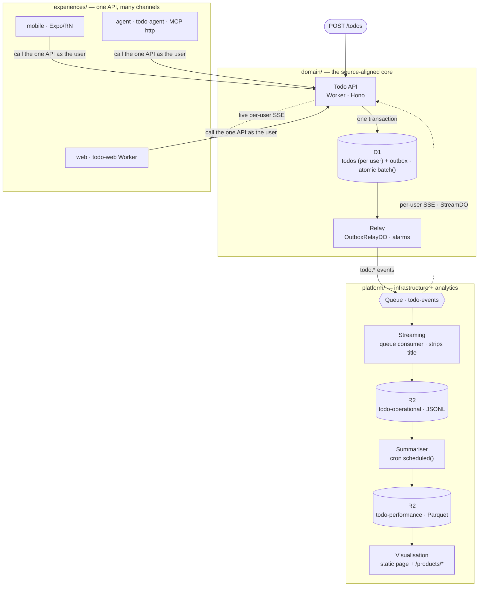

# outcome-app-pattern-cloudflare

The [outcome-app-pattern](https://github.com/dataGriff/outcome-app-pattern) reference —
a **source-aligned, API-first, multichannel domain** — rebuilt to run entirely on
**Cloudflare's free plan**, in TypeScript, as a **per-user todo-list domain**.

Same pattern; both the platform *and* the domain change. The source repo proves the shape
with a global colour domain on containers; this repo proves the same shape generalises — a
serverless platform underneath, and a deliberately different domain (todos with per-user
state, authenticated CRUD, per-user live streams, PII-free analytics) on top. It is also the
first dry run of the source repo's
[replication guide](https://github.com/dataGriff/outcome-app-pattern/blob/main/docs/replication/index.md):
the three zones, the naming rules, and the contract-first order of work all carry over. Every
role keeps its name; the full role → Cloudflare mapping is in
[docs/architecture](docs/architecture/index.md).

## The pattern



The same shape as the [source pattern](https://github.com/dataGriff/outcome-app-pattern) — only
the implementation labels and the domain differ. See
[docs/architecture](docs/architecture/index.md).

## Run it locally

One command brings up all four workers, each on its own port, wired by Wrangler's
local dev registry (service bindings **and** cross-process queue delivery):

```bash
npm ci
task up      # domain :8787  data-products :8788  web :8789  agent :8790
```

With Cloudflare Access unprovisioned (the default), every request acts as the fixed dev
identity — so the per-user paths run locally with no tokens. Open the web channel at
http://localhost:8789, run the mobile app with `task run:mobile`, or point an MCP client at
http://localhost:8790/mcp. `task ci` runs the whole hermetic suite. Full local-dev detail is in
[docs/development](docs/development/index.md).

## Documentation

All documentation is indexed in **[docs/index.md](docs/index.md)** — the canonical topic
router for humans and agents. Start there for:

- [Architecture](docs/architecture/index.md) — the pattern, the three zones, the role mapping.
- [Contracts](docs/contracts/index.md) — the OpenAPI, AsyncAPI, and data contracts.
- [Development](docs/development/index.md) — multi-process local dev and the Taskfile.
- [Testing](docs/testing/index.md) — the hermetic suite and the post-deploy `datacontract test`.
- [Data products](docs/data-products/index.md) — the R2 storage model and incremental summariser.
- [Experiences](docs/experiences/index.md) — web, mobile, agent — and the deployed MCP agent.
- [Security](docs/security/index.md) — Cloudflare Access, the per-user model, the dev identity.
- [Deployment](docs/deployment/index.md) — cloud setup, CI secrets/vars, deploy + verify.
- [Productionising](docs/productionising/index.md) · [Replication](docs/replication/index.md).

Agents: the working agreement is [AGENTS.md](AGENTS.md).
