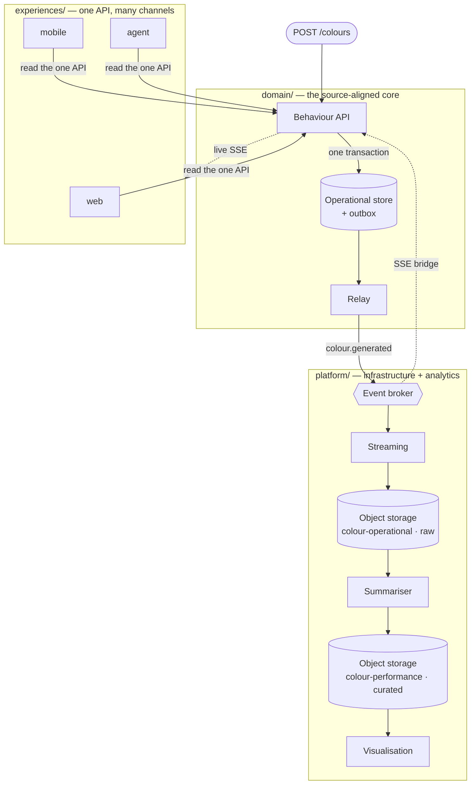
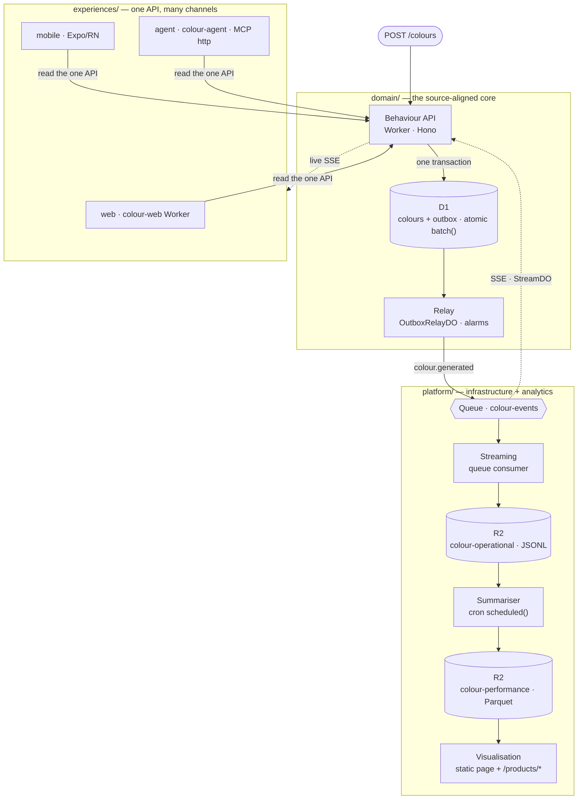

# Architecture

The [outcome-app-pattern](https://github.com/dataGriff/outcome-app-pattern) — a
**source-aligned, API-first, multichannel domain** — ported to Cloudflare's free plan. The
structure is unchanged from the source: the three zones, the naming rules, and the
contract-first order of work all carry over; only the implementations behind the role names
are swapped.

## The pattern

The logical shape, independent of any platform — this diagram is **byte-identical** to the one
in the [source repo](https://github.com/dataGriff/outcome-app-pattern/blob/main/docs/architecture/index.md);
only the [implementation](#this-implementation) labels below change:

## The three zones

| Zone | Owns |
| --- | --- |
| `domain/` | The behaviour Worker, the D1 operational store + outbox, the relay Durable Object, all contracts, and the event schema. |
| `experiences/` | One directory per channel — `web`, `mobile`, `agent` — each consuming the one API. See [experiences](../experiences/index.md). |
| `platform/` | The queue consumer (→ raw JSONL), the summariser (→ curated Parquet), and the visualisation page. See [data products](../data-products/index.md). |

## This implementation

The same pattern, realised on Cloudflare — identical topology to [the pattern](#the-pattern)
above, concrete primitives in each box (Workers, D1, Queues, R2, …). The relay fans out to the
Queue **and** the `StreamDO` that holds the live SSE connections:

Every role keeps its name; only the implementation underneath is swapped (role-named bindings,
honest implementation names in `wrangler.jsonc`):

| Pattern role | Source implementation | Cloudflare implementation |
| --- | --- | --- |
| behaviour API | FastAPI | `colour-behaviour-service` Worker (Hono) |
| operational-store | Postgres | D1 — one atomic `batch()` is the outbox transaction |
| relay | asyncpg loop | `OutboxRelayDO` Durable Object (poke on write + alarm backstop + prune) |
| events | NATS | Queue `colour-events` |
| SSE bridge | in-API NATS subscriber | `StreamDO` Durable Object (SSE fan-out) |
| streaming | bento | queue consumer → JSONL to R2 |
| object-storage | SeaweedFS (S3) | R2 bucket `colour-data` |
| summariser | pandas loop | cron `scheduled()` → Parquet |
| visualisation | Streamlit | static page + `/products/*` read endpoints |
| web experience | Flask | `colour-web` Worker (static assets + same-origin proxy) |
| mobile experience | Expo/React Native | unchanged (points at the deployed API) |
| agent experience | MCP server (stdio) | `colour-agent` Worker (MCP over streamable-http) |
| identity (port addition) | — (source is open) | Cloudflare Access issues JWTs; every Worker validates them with the shared `access-jwt` verifier. See [security](../security/index.md). |

## What the platform swap forced

The interesting decisions a serverless port makes — D1 can't share a DB clock so the app
supplies the one shared outbox timestamp; the relay is a Durable Object with alarms rather than
an always-on loop; Queues are single-consumer so the relay fans out itself (queue for the data
product + best-effort SSE broadcast). The full analysis lives in the source repo's
[replication guide](https://github.com/dataGriff/outcome-app-pattern/blob/main/docs/replication/index.md),
which this repo was the dry run for (see [replication](../replication/index.md)).

The **platform zone also collapses to one Worker.** The source repo splits `platform/` into
separate container services — `streaming/` (bento), `storage/` (SeaweedFS), `analytics/summariser`
and `analytics/visualisation` (Streamlit). Here the streaming consumer (`queue()`), the summariser
(`scheduled()` cron), the products read surface, and the static visualisation all live in the one
`colour-data-products` Worker, sharing the R2 binding and deploying together. There is **no
`platform/storage/`** — R2 is managed (created by `task bootstrap:cloud`), and the operational
store's schema lives in D1 migrations under `domain/`, not the platform zone. Same roles (they're
all in the mapping above), fewer moving parts.
